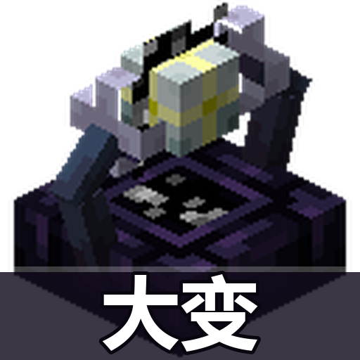

# 嬗变台：大变

[](LICENSE)
[](https://www.minecraft.net/)
[](https://files.minecraftforge.net/)
[](https://forge.minecraftforge.net/)

**纯客户端** Forge 模组（1.20.1），为 [Alex's Mobs](https://modrinth.com/mod/alexsmobs) 的**嬗变台**提供自动化。

A **client-side** Forge mod (1.20.1) that automates the **Transmutation Table** from [Alex's Mobs](https://modrinth.com/mod/alexsmobs).



---

## 这是什么

打开嬗变台后，它会**一直自动嬗变**，直到三个候选里出现你标记的物品为止 —— 出现就停手，不会把目标点掉。

**Open the transmutation table and it keeps transmuteing on its own until one of the three candidates is an item you marked, at which point it stops without consuming it.**

---

## 为什么是"一直点"而不是"只点目标"

嬗变台的权重是**累积**的。按 wiki 公式，换出物品减少权重 `= log₁₀(数量)⁴`：

| 换出数量 | 权重减少 |
|---|---|
| 1 | **0** |
| 10 | 4 |
| 100 | 8 |

log 增长极快。**只点目标**意味着"哪些物品被换出"不受控 —— 它们的权重会被持续压低，目标反而越来越难出现。一直点才能让换出量可控。

The table's weights are cumulative, and removing an item costs `log10(count)^4`. Only clicking the target leaves which items get consumed to chance, so their weights get pressed down and the target becomes harder to roll. Transmuting continuously keeps the amount consumed under control.

### 避开堆叠上限不同的选项

数量换算在服务端做：`新数量 = floor(原数量 × 新堆叠上限 / 原堆叠上限)`。所以雪球（上限 16）嬗变后可能变成 4 个木棍（上限 64）。

每点一次物品就变多，被换出物品的权重按 log 疯涨，其他物品权重被迅速压低。

**1.0.1 起，模组避开所有堆叠上限与当前物品不同的候选**，而不只是"会变多"的那些。原因是"上限变小"只是把膨胀延后：

```
泥土(64) → 雪球(16)   得到 1 个雪球（数量没变，看着安全）
雪球(16) → 木棍(64)   得到 4 个木棍  ← 突然膨胀
```

物品在上限不同的空间里来回跳，每一次跳都是一次权重扰动。三个候选上限都对不上时，**选数值最接近的那个**（换算倍数最接近 1，扰动最小）——卡着不动等于完全刷不到东西。

> ⚠️ **建议槽位里放上限为 64 的普通物品**（泥土、木棍、石头之类）。
> 如果放的是钻石、煤这类**上限为 1** 的物品，当三个候选都是上限 16 的
> （雪球、末影珍珠等）时，退让换算会得到 1 × 16 ÷ 1 = **16 个**。
> 这是服务端公式决定的，模组无法完全避免 —— 只能靠换个起始物品。

The server computes `newCount = floor(count * newMax / oldMax)`, so a higher stack limit multiplies what you hold. Since 1.0.1 every candidate whose stack limit differs from the current item is skipped, not just the ones that grow: a *smaller* limit only defers the problem, as dirt(64) → snowball(16) keeps the count at 1 but the next step to sticks(64) jumps to 4. When none of the three match, the closest limit is taken, since a stalled loop produces nothing. Prefer a stack limit of 64 in the slot; starting from an item with limit 1 means 1 × 16 ÷ 1 = 16 if all three candidates are limit 16, which the server formula makes unavoidable.

---

## 功能

- **自动循环字变**，直到出现标记物品
- **物品选择器**（叠在嬗变台之上）：支持中文名与英文名搜索，可选注册表里的任意物品
- **避开数量膨胀的候选**，把权重扰动压到最小
- **经验不足自动暂停**，经验够了自动继续（不丢状态）
- **34 项中英文界面**，日志也随语言切换
- 嬗变间隔 1–20 tick 可调
- 不写世界数据，卸载即净

**Auto-transmute** continuously until a target appears, with an item selector layered over the table, stack-growth avoidance, pause-and-resume on low experience, 34 localised strings on both sides of the language divide, an adjustable 1–20 tick interval, and no world writes at all.

---

## 使用方法 / Usage

1. 打开嬗变台，左侧会出现本模组的面板
   Open a transmutation table; the panel appears on its left
2. 点「**+ 添加**」打开选择器，搜索并点选目标物品（中文名或英文名都行）
   Press **+ Add** and pick target items from the selector
3. 放 **1 个**想嬗变的物品在嬗变台里
   Put **one** item in the table
4. 打开「自动孖变」开关
   Turn on the toggle

面板上的候选项预览会实时显示三个候选，**命中目标的会标绿框** —— 伸手前就知道会不会点掉它。

The panel previews the three live candidates and outlines a hit in green, so you can see whether it will consume the target before it happens.

### 命令 / Commands

指令保留为备份入口（脚本、或者不方便开界面时用）：

```
/ta mark <物品>      添加目标
/ta unmark <物品>    移除目标
/ta list             查看当前目标
/ta clear            清空目标
/ta status           查看状态
/ta interval <tick>  设置孖变间隔
```

### 快捷键

`←` / `→` 在选择器里翻页，`Esc` 关闭，`Tab` 切换搜索框焦点。

---

## 前置 / Requirements

| 依赖 | 版本 |
|---|---|
| Minecraft | 1.20.1 |
| Forge | 47.4.22+ |
| Alex's Mobs | 1.22+ |

**客户端与服务端都要装。** 本模组是纯客户端的，但 Alex's Mobs 本身需要两端都在。

**Install on both client and server.** This mod is client-only, but Alex's Mobs is required on both sides.

---

## 已知取舍 / Known trade-offs

- **破坏是瞬时的**，不模拟挖掘时间 —— 这让行为可预测，也避免"挖到一半被打断"的复杂状态。
  **Breaking is instantaneous**, which keeps behaviour predictable and avoids half-dug states.
- **槽位里的物品会被消耗**（这是嬗变台本身的规则），物品不足时循环会自然停下。
  **The item in the slot is consumed** — that is the table's own rule; the loop stops when there is nothing left to transmute.
- 依赖 Alex's Mobs 的内部类（`MessageTransmuteFromMenu`），该模组大版本更新时可能需要适配。
  Relies on Alex's Mobs internals, so a major update may need work.

---

## 构建 / Building

```bash
./gradlew jar
```

> 中文模组名放在 `gradle/mod_text.properties`（纯 ASCII + `\uXXXX` 转义）。
> Groovy 读 `.properties` 用平台默认编码，Windows 上是 GBK，直接写中文会变成乱码。
>
> The display name lives in `gradle/mod_text.properties` as pure ASCII with `\uXXXX`
> escapes, because Groovy reads `.properties` with the platform encoding, which is
> GBK on Windows.

`Alex's Mobs` 的 jar 需自行放入 `mcmodsrepo/`（已 gitignore，不分发），由 `.pom` 提供本地 maven 入口供 `fg.deobf` 重映射。

---

## 声明 / Credits

- 开源协议：MIT
- 模组图标基于 Alex's Mobs 的嬗变台渲染图制作
- 感谢 [Alex's Mobs](https://modrinth.com/mod/alexsmobs) 及其作者

Licensed under the MIT License. The icon is derived from Alex's Mobs' transmutation table render.
